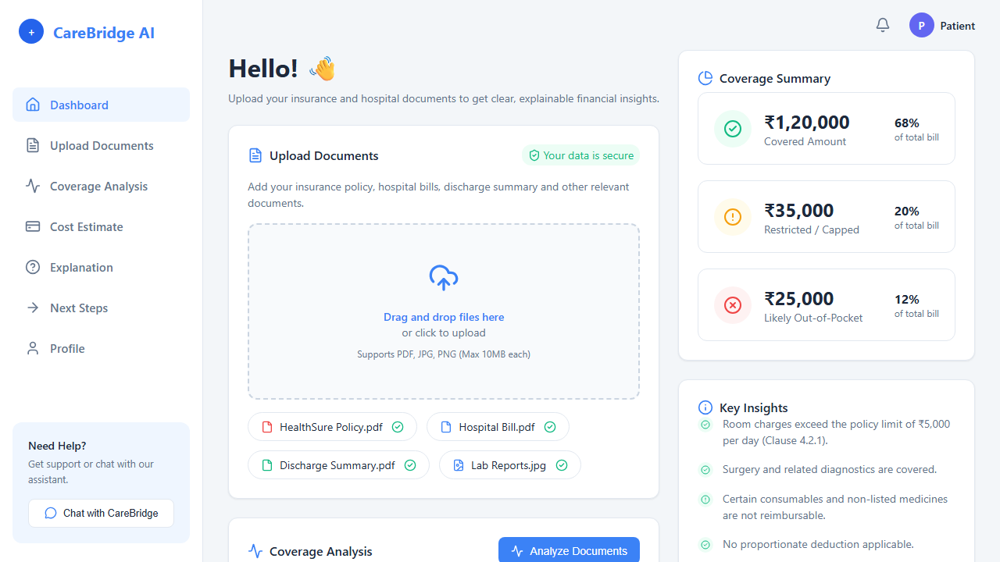

# CareBridge AI

CareBridge AI is an India-specific decision-support and information platform designed to solve the financial and informational uncertainty patients and their families face during hospital admission.

## Screenshots


*(UI prototype built during development showcasing the CareBridge Dashboard, Upload, Analysis, and Summaries.)*


## Problem Statement

Although people may have private insurance, employer insurance, or government schemes, actual policy information is usually buried inside lengthy PDFs and complicated terms. During an emergency, families often don't know:
- Which hospitals are covered
- Whether the hospital is cashless or in-network
- What room category they are eligible for
- Which procedures or consumables are reimbursable
- What deductions or exclusions apply

## Solution: The Understand → Analyse → Guide Flow

CareBridge AI acts as an insurance-aware financial decision-support layer. The frontend is centered around a **simple, calm, and highly visual dashboard**.

1. **Understand**: The interface shows uploaded documents and an AI-generated structured summary of what the policy actually says.
2. **Analyse**: The extracted information is passed into a deterministic policy engine, where policy rules such as room limits, exclusions, coverage restrictions, and deductibles are evaluated.
3. **Guide**: The frontend turns those results into actionable financial information: estimated covered amounts, possible out-of-pocket expenses, relevant hospital and room eligibility, and next steps.

## Technical Architecture

Documents enter the system → AI extracts and understands their contents → structured policy information is generated → a deterministic Policy Engine evaluates the rules → financial impact is calculated → the frontend explains the result.

## Development Setup

This project uses React and Vite.

### Prerequisites
- Node.js (v16 or higher)
- npm or yarn

### Installation
```bash
npm install
```

### Running Locally
```bash
npm run dev
```

### Building for Production
```bash
npm run build
```
